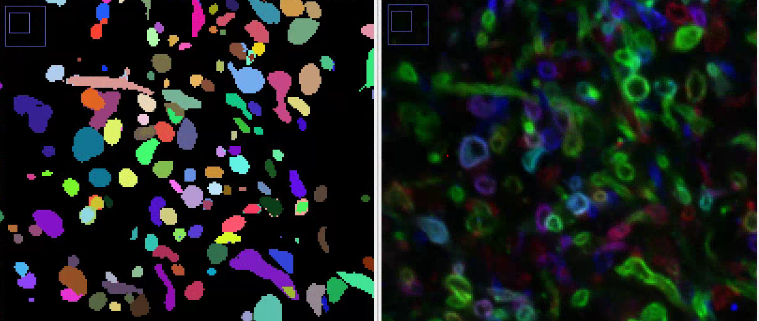

# FFN_LM
#1，data processing   #2，train   #3，inference   

Source of raw data:
Tillberg, P.W.*, Chen, F.*, Piatkevich, K.D., Zhao, Y., Yu, C.-C., English, B.P., Gao, L., Martorell, A., Suk, H.-J., Yoshida, F., DeGennaro, E.M., Roossien, D.H., Gong, G., Seneviratne, U., Tannenbaum, S.R., Desimone, R., Cai, D., Boyden, E.S. (2016) Protein-retention expansion microscopy of cells and tissues labeled using standard fluorescent proteins and antibodies, Nature Biotechnology 34:987–992. (*, co-first authors)
